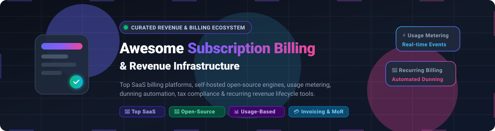

# 🏷️ Awesome Tag Management System (TMS)

<div align="center">



<p align="center">
  <a href="https://github.com/ishandutta2007/Awesome-Awesome-Awesome"></a><a href="https://discord.gg/jc4xtF58Ve"></a>
  <a href="https://github.com/ishandutta2007/Awesome-Tag-Management-System/stargazers"></a>
  <a href="https://github.com/ishandutta2007/Awesome-Tag-Management-System/network/members"></a>
  <a href="https://github.com/ishandutta2007/Awesome-Tag-Management-System/blob/main/LICENSE"></a>
  <a href="https://github.com/ishandutta2007/Awesome-Tag-Management-System/pulls"></a>
  <a href="https://github.com/ishandutta2007"></a>
</p>

**A curated index of premier Tag Management Systems (TMS), server-side tagging engines, consent-aware data layer libraries, and marketing analytics orchestration tools.**

*Targeted at Analytics Engineers, Growth Marketers, Data Architects, and Privacy Officers.*

</div>

---

## 📑 Table of Contents
- [📖 Overview & Architecture](#-overview--architecture)
- [☁️ SaaS & Hosted Platforms](#️-saashosted-platforms)
- [📦 Open-Source GitHub Projects](#-open-source-github-projects)
- [🛡️ Key Tag Management Architecture Patterns](#️-key-tag-management-architecture-patterns)
- [🤝 How to Contribute](#-how-to-contribute)
- [⭐ Star History](#-star-history)
- [📜 Disclaimer](#-disclaimer)

---

## 📖 Overview & Architecture

A **Tag Management System (TMS)** orchestrates third-party tracking scripts, marketing pixels, and analytics events across websites, Single Page Applications (SPAs), and mobile apps without requiring manual code deployments. Modern TMS ecosystems bridge client-side data capture (`dataLayer`), server-side event distribution (sGTM, Conversions API), and Consent Management Platforms (CMP) to ensure strict GDPR/CCPA/CPRA compliance, reduce browser payload, and bypass ad-blocker signal loss.

---

## ☁️ SaaS/Hosted Platforms

> 📊 **Market Size & Structure**: The global Tag Management Systems (TMS) market is estimated at **$2.1 Billion in 2026** (projected to reach **$4.8 Billion by 2032** at a **14.2% CAGR**). The sector is **highly concentrated at the entry level** (winner-take-most dynamics dominated by Google Tag Manager capturing >80% web share) but **moderately fragmented in enterprise, server-side, and privacy-first tiers**, where specialized vendors (Adobe, Cloudflare, Tealium, Piwik PRO, RudderStack) compete for mission-critical compliance and data-governance workloads.

*Sorted descending by company size, valuation, and annual revenue.*

| Platform | Company Valuation / Revenue | Starting Pricing | Free Tier / Trial Limits | Description |
| :--- | :--- | :--- | :--- | :--- |
| **[Google Tag Manager](https://tagmanager.google.com/)** | **~$2.2T+ Market Cap** / ~$350B+ Rev *(Alphabet)* | Free ($0/mo standard); GTM 360 starts at ~$150,000/year (~$12,500/mo) | **Free forever** with up to 3 workspaces per container and 200 KB container size limit. | The industry standard tag management system for web and mobile, featuring visual trigger/variable builders, consent mode, and Google ecosystem integration. |
| **[Adobe Experience Platform Tags](https://experienceleague.adobe.com/docs/experience-platform/tags/home.html)** | **~$220B+ Market Cap** / ~$21.5B+ Rev *(Adobe Inc.)* | Included with Adobe Experience Cloud (packages start at ~$30,000+/year) | **Included at $0 extra cost** for active Adobe Experience Cloud licensees; 30-day sandbox via enterprise account rep. | Adobe’s enterprise tag deployment engine (formerly Launch) integrated with Adobe Analytics, Target, and Experience Platform Edge Network. |
| **[Cloudflare Zaraz](https://www.cloudflare.com/application-services/products/zaraz/)** | **~$35B+ Market Cap** / ~$1.6B+ Rev *(Cloudflare)* | $5/mo per 1M additional events (after free allocation) | **Free forever** up to 1,000,000 Zaraz events/month with all tools, rules, and privacy triggers included. | Edge-based server-side tag manager executed in Cloudflare Workers to eliminate client-side script overhead and improve page speed. |
| **[Twilio Segment](https://segment.com/pricing/)** | **~$12B+ Market Cap** / ~$4.3B+ Rev *(Twilio)* | $120/mo for Team plan (up to 10,000 MTUs) | **Free forever** up to 1,000 MTUs (Monthly Tracked Users), 2 sources, and unlimited destinations. | Customer data platform and tag routing system that consolidates marketing pixels and client scripts into a single API pipeline. |
| **[Tealium iQ](https://tealium.com/products/tealium-iq-tag-management/)** | **~$1.2B+ Valuation** / ~$150M+ ARR *(Tealium)* | ~$30,000–$75,000/year (~$2,500–$6,250/mo) depending on MUV volume | **14-day guided proof-of-concept** sandbox upon sales consultation (no public self-serve free plan). | Enterprise tag management platform with 1,300+ turnkey integrations, robust data-layer management, and consent controls. |
| **[CHEQ Ensighten](https://www.ensighten.com/)** | **~$1.0B+ Valuation** / ~$100M+ ARR *(CHEQ)* | ~$75/mo (basic monitoring); Enterprise tag governance from ~$1,500/mo (~$18,000/year) | **14-day proof-of-concept trial** upon sales request (no public self-serve free plan). | Security-focused enterprise tag management and data governance platform providing client-side script containment and zero-trust protection. |
| **[Coveo (formerly Qubit)](https://www.coveo.com/)** | **~$600M+ Market Cap** / ~$130M+ Rev *(Coveo)* | Enterprise packages starting at ~$30,000/year (~$2,500/mo) | **14-day free trial** with access to core platform indexing and personalization prototypes (no credit card required). | Personalization and experience tag management capabilities within the broader Coveo Relevance Cloud platform. |
| **[RudderStack](https://www.rudderstack.com/pricing/)** | **~$300M+ Valuation** / ~$35M+ ARR *(RudderStack)* | $265/mo for Growth plan (1M events/month) | **Free forever** up to 250,000 events/mo, 16+ SDK sources, and 200+ destinations; 30-day trial for Growth plan. | Warehouse-native tag and customer data orchestration platform with declarative event routing and governance. |
| **[Commanders Act](https://www.commandersact.com/)** | **~€25M+ ARR** (~$27M+) *(Private)* | ~€18,000–€36,000/year (~€1,500–€3,000/mo) | **30-day staging pilot** via enterprise sales inquiry (no self-serve free plan). | European tag management and customer data platform (TagCommander) with built-in consent orchestration and server-side tracking. |
| **[Piwik PRO Tag Manager](https://piwik.pro/)** | **~€15M+ ARR** (~$16M+) *(Private)* | €35/mo (~$38/mo) for Business plan (up to 2M actions/mo); Enterprise from €366/mo | **30-day free trial** of Business plan (full feature access up to 2M actions, 25-month data retention, no credit card required). | Privacy-centric tag management component of the Piwik PRO Analytics Suite, designed for strict GDPR/HIPAA compliance and consent workflows. |
| **[Matomo Cloud](https://matomo.org/pricing/)** | **~$10M+ ARR** *(InnoCraft / Private)* | $26/mo (€29/mo) for up to 50,000 monthly hits | **21-day free trial** with full feature access up to 50k hits (no credit card required); 100% free forever if self-hosted (Matomo On-Premise). | Hosted tag manager bundled within the Matomo analytics platform providing full data ownership and cookieless tracking options. |
| **[Stape.io](https://stape.io/)** | **~$5M+ ARR** *(Bootstrapped / Private)* | $20/mo ($17/mo billed annually) for up to 500k requests | **Free forever** up to 10,000 server requests/mo and 5 free sGTM containers; 7-day free trial on CAPI Gateways. | Turnkey server-side Google Tag Manager (sGTM) and Conversions API hosting infrastructure with custom loaders and global CDN. |

---

## 📦 Open-Source GitHub Projects

*Sorted descending by GitHub repository star counts.*

- **[PostHog](https://github.com/PostHog/posthog)** [](https://github.com/PostHog/posthog/stargazers)  
  Open-source product analytics OS with automated event capture, custom web tag injection, session replay, feature flags, and data pipeline integrations.

- **[Plausible Analytics](https://github.com/plausible/analytics)** [](https://github.com/plausible/analytics/stargazers)  
  Lightweight, privacy-first open-source web tracking script (<1 KB) with zero cookie requirements, custom event tagging, and automated proxy routing.

- **[Matomo](https://github.com/matomo-org/matomo)** [](https://github.com/matomo-org/matomo/stargazers)  
  Leading self-hosted analytics platform featuring an integrated, production-grade Tag Manager with custom triggers, variables, data layer support, and GDPR consent management.

- **[Partytown](https://github.com/BuilderIO/partytown)** [](https://github.com/BuilderIO/partytown/stargazers)  
  Relocates third-party marketing tags, analytics scripts, and pixel libraries off the main browser thread into a dedicated Web Worker to maximize Core Web Vitals.

- **[Snowplow](https://github.com/snowplow/snowplow)** [](https://github.com/snowplow/snowplow/stargazers)  
  Enterprise-grade behavioral data collection platform offering client and server-side tracking pipelines, real-time schema validation, and warehouse routing.

- **[CookieConsent](https://github.com/orestbida/cookieconsent)** [](https://github.com/orestbida/cookieconsent/stargazers)  
  Lightweight, multi-lingual cookie consent management library designed to gate script execution and conditionally trigger tag containers based on user consent signals.

- **[Jitsu](https://github.com/jitsucom/jitsu)** [](https://github.com/jitsucom/jitsu/stargazers)  
  Open-source data ingestion engine and event dispatcher acting as a modern server-side tag manager, reverse proxy, and Segment alternative.

- **[Analytics.js](https://github.com/segmentio/analytics.js)** [](https://github.com/segmentio/analytics.js/stargazers)  
  Segment’s battle-tested open-source client SDK that captures user interactions and fans them out to hundreds of marketing and analytics destinations.

- **[RudderStack Server](https://github.com/rudderlabs/rudder-server)** [](https://github.com/rudderlabs/rudder-server/stargazers)  
  Open-source enterprise customer data engine that receives, filters, transforms, and delivers tag events to cloud destinations and data warehouses.

- **[walkerOS](https://github.com/elbwalker/walkerOS)** [](https://github.com/elbwalker/walkerOS/stargazers)  
  Open-source, developer-centric event tracking engine treating tag management as code, with declarative markup tagging, data sovereignty, and consent-aware triggers.

- **[Scale8 Tag Manager & Analytics](https://github.com/scale8/scale8-tag-manager-and-analytics)** [](https://github.com/scale8/scale8-tag-manager-and-analytics/stargazers)  
  Open-source Google Tag Manager alternative providing a visual container builder, single-page application (SPA) support, custom variables, and GDPR/CCPA compliance.

- **[Matomo Tag Manager Plugin](https://github.com/matomo-org/tag-manager)** [](https://github.com/matomo-org/tag-manager/stargazers)  
  Dedicated repository for Matomo's tag management core engine, enabling custom tag, trigger, and variable definitions for on-premise deployments.

---

## 🛡️ Key Tag Management Architecture Patterns

```
┌────────────────────────────────────────────────────────┐
│                   User Browser / App                   │
│  ┌───────────────────┐        ┌─────────────────────┐  │
│  │   window.dataLayer │───────▶│ Client Tag Manager  │  │
│  └───────────────────┘        └──────────┬──────────┘  │
└──────────────────────────────────────────┼─────────────┘
                                           │ (First-Party HTTP / WebSocket)
                                           ▼
┌────────────────────────────────────────────────────────┐
│            Edge / Server-Side TMS Gateway              │
│  (Cloudflare Zaraz / Stape.io / RudderStack / Jitsu)   │
│  ┌──────────────────────────────────────────────────┐  │
│  │   • Consent Validation (CMP)                     │  │
│  │   • PII Sanitization & IP Masking                │  │
│  │   • Enrichment & Transformation                  │  │
│  └───────────────────────┬──────────────────────────┘  │
└──────────────────────────┼─────────────────────────────┘
                           │
       ┌───────────────────┼───────────────────┐
       ▼                   ▼                   ▼
┌──────────────┐    ┌──────────────┐    ┌──────────────┐
│  Analytics   │    │     Ad &     │    │ Data Lake /  │
│ (GA4/Matomo) │    │  Conversion  │    │  Warehouse   │
│              │    │  (Meta CAPI) │    │ (BigQuery)   │
└──────────────┘    └──────────────┘    └──────────────┘
```

1. **Client-Side Data Layer Standard**: Centralize all telemetry into a structured `window.dataLayer.push()` event contract.
2. **Consent-Gated Execution**: Prevent any marketing or ad pixels from executing until explicit CMP approval is verified.
3. **Hybrid / Server-Side Fan-out**: Route raw client signals through a first-party proxy (sGTM, Zaraz, or RudderStack) to scrub PII, enhance data quality, and protect user privacy.

---

## 🤝 How to Contribute
1. Fork the repository.
2. Add or update entries in [README.md](README.md) following the existing table or list format.
3. Ensure SaaS entries include verified starting pricing, company size/valuation, and free tier/trial limits.
4. Ensure open-source entries include the social star badge linking to the repository stargazers page.
5. Submit a Pull Request with a clear description of the addition.

---

## ⭐ Star History

[](https://star-history.dera.page/#ishandutta2007/Awesome-Tag-Management-System&type=date&legend=top-left)

---

## 📜 Disclaimer
- This repository is a **community-curated index** for informational and educational purposes.
- Tag management tools execute arbitrary client and server-side code. Always enforce strict Content Security Policies (CSP), audit data layer variables, and configure Consent Mode to remain compliant with GDPR, CCPA/CPRA, and ePrivacy regulations.
